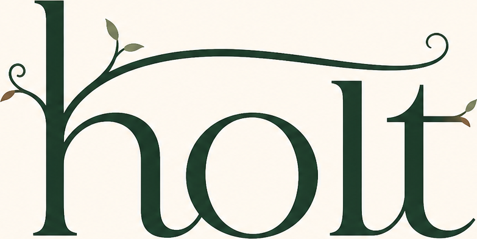

<div align="center">



# Holt

### The transaction and recoverability layer for parallel coding agents.

**Holt makes in-flight repository work observable, recoverable, and safe to act on before a
cleanup, merge, or landing decision.**

[](#license)
[](https://raed2180416.github.io/holt/)

</div>

<!-- HOLT:SOCIAL-PROOF:BEGIN
Social proof stays commented out until the numbers can carry it: 500 stars, whichever lands
first. scripts/milestone.mjs switches this block on by itself.

<div align="center">

[](https://github.com/raed2180416/holt/stargazers)
[](https://github.com/raed2180416/holt/actions/workflows/ci.yml)

<a href="https://star-history.com/#raed2180416/holt&Date">
  
</a>

</div>
HOLT:SOCIAL-PROOF:END -->

> **Current status:** The free, local, single-repository core is available in the v0.3.1 source
> tree. Team and Enterprise are not being sold or activated in this launch. Design-partner work
> described in [the program](docs/launch/DESIGN-PARTNER-PROGRAM.md) is a proposed validation path,
> not a production-readiness or customer-traction claim.

## The short version

Coding agents make parallel software work cheap. They also leave valuable state distributed
across commits, the index, unstaged edits, untracked files, ignored paths, branches, and linked
worktrees. Ordinary Git commands can inspect those pieces, but do not give one repository-wide
answer to the transaction question:

> **If this workspace is cleaned up or this change is landed now, what unique work could be lost or
> misintegrated—and what recovery path exists?**

Holt is the layer at that seam. It relates the real local state, separates exact evidence from
advisory intelligence, preserves work before a destructive action, re-checks the action boundary,
and emits a recovery receipt. It is complementary to Git, worktree managers, CI, editors, and
agent orchestrators; it is not a replacement for any of them.

The core loop is:

```text
observe → classify → protect → gate → act → verify/recover
```

## Install and try the core

Holt currently requires Node `^22.22.2 || ^24.15.0 || >=26.0.0` and Git 2.45 or newer. Git 2.45
is the safety floor for the local-object checks Holt performs. This source checkout describes
v0.3.1. The stable URL below installs the latest version that has actually been published, which
may differ until this checkout is released; verify `holt --version`, the release notes, and the
checksums for the exact artifact you install.

```bash
npm install -g https://github.com/Raed2180416/holt/releases/latest/download/holt.tgz
cd your-repository
holt setup       # inspect available backends and project-scoped integrations
holt auto        # perform reversible protection; make no deletion decision for you
holt status      # inspect the evidence and remaining decisions
```

For a no-global-install trial:

```bash
npx github:Raed2180416/holt status
```

`holt clean` is a dry run. `holt clean --apply` re-checks candidates immediately before moving
provably disposable worktrees into locked local quarantine; it does not delete files or branches
and returns the exact restore path. `holt purge` is a separately named, dry-run-first disk
reclamation action and requires an explicit apply step after review.

## What is available today

The current free/core boundary is local, Git-native, and single-repository. It does not require an
account, hosted code upload, telemetry, or a managed control plane.

| Job | Current surface | What the result means |
|---|---|---|
| See the repository-wide state | `status`, `risk`, `context`, TUI, offline relationship graph | A measured view of workstreams, unique content, collisions, duplicates, dependencies, and bounds. |
| Decide whether work is disposable | `gate`, `clean`, `protect`, `auto` | Exact path/content/reachability evidence can hold or permit an action. Unknown or unmeasured state stays unknown. |
| Preserve before acting | `rescue`, `discard`, `clean --apply`, `quarantines`, `restore` | Capture or quarantine is verified before release; recovery remains local and explicit. |
| Coordinate parallel work | `collisions`, `hotspots`, `duplicates`, `impact`, `order`, `partition`, `branches`, `stash`, `plan` | Relationship findings guide review and landing. They are not silently promoted into destructive authority. |
| Connect agents | Project-scoped MCP, `brief`, `integrate`, and host-specific hooks | Capability is reported per host as advisory, contract-tested, or live-observed; configuration on disk is not proof of a live deny. |
| Review incidents and provenance | `journal`, `forensics`, `audit` | Local receipts and package/runtime checks can be inspected offline on customer-controlled storage. |

The most important product rule is the boundary between proof and advice:

- Exact path, operation, mode, object type, object identity, and verified recovery evidence can
  influence destructive authority.
- Symbol overlap, clone similarity, dependency impact, family grouping, and landing order are
  useful review signals. They do not prove semantic equivalence or permission to delete.
- A failed instrument, an exceeded bound, or an unmeasured path lowers confidence. It does not
  become a clean-looking answer.

## A five-minute mental model

Imagine three agents working in linked Git worktrees:

```text
agent A: one local commit
agent B: staged edits plus an untracked migration
agent C: ignored generated output that is the only copy of a useful artifact
```

Branches alone do not describe that state. Holt builds a repository-wide evidence view, identifies
what is unique, and keeps a cleanup operation reversible:

```text
inspect → protect or rescue → re-check → quarantine → restore if needed
```

The same model applies before landing: show collisions, dependencies, and the evidence behind the
proposed order, then run the supplied combination test when a specific interaction needs empirical
verification. A clean supplied test means only that that test observed no combination-only failure;
it is not a universal compatibility certificate.

## Where Holt fits

| Existing tool or layer | Its job | Holt's boundary |
|---|---|---|
| Git and Git worktree | Version control and workspace primitives | Relate local state across worktrees before a lock, cleanup, or landing action. |
| Worktree managers | Create, move, and organize worktrees | Supply repository-wide content evidence and recovery-first disposition. |
| Agent orchestrators and editors | Dispatch and operate agents | Supply the transaction context and action seam; Holt does not choose the task or model. |
| CI and merge queues | Test and order committed changes | Protect valuable pre-PR state and investigate specific interactions before work is shared. |
| Hosted agent/cloud sandboxes | Run work away from a local machine | Local locks do not reach cloud or ephemeral agents by default; no cloud enforcement claim is made. |

The category is intentionally narrow: **Holt is not “42 Git commands,” an all-in-one DevOps suite,
or a managed fleet control plane. It is the integrity layer around parallel agent transactions.**

## Integration coverage

`holt integrate` writes project-scoped files and preserves existing user configuration. Re-running it
repairs Holt-owned entries without duplicating them; `holt uninstall` removes only receipt-owned,
unchanged artifacts. Host configuration on disk is not evidence that a host loaded, trusted, or
enforced it.

- **MCP** — 16 tools in the executable schema. The protocol path is exercised over stdio as
  `initialize → 16 tools → tools/call`; MCP remains reactive model-pull unless a host supplies a
  separate lifecycle context hook.
- **Implemented deterministic pre-tool blocking** — Claude Code, OpenCode, Cursor, Codex local clients, Qwen Code, Copilot CLI, Cline IDE, Goose, Devin CLI and Devin Desktop Cascade cover their documented local surfaces. Their current schemas are contract-tested, but none is currently claimed as a real-host enforcement run.
- **Hook-capable, not yet wired** — Gemini, Crush, Amp, Factory and Junie still receive MCP + advisory.
- **Cloud or ephemeral** — Codex cloud, Copilot cloud, Cursor cloud, Google Jules, Replit Agent do not receive local worktree enforcement by default.

Holt describes nearly 30 distinct agent product surfaces, but support is deliberately split by
evidence grade. Current MCP/hook files for Cursor, Codex, Qwen Code, Copilot, Cline, Goose, Continue, Devin CLI, Cascade, Crush, Gemini CLI and VS Code are generated and parsed in schema fixtures. Gemini, Crush, Amp, Factory and Junie hooks are still unverified and unwired; their hosts remain MCP-capable rather than live-verified blockers. Run `holt providers`, `holt hosts`, and `holt doctor --json` for the machine-readable provider, configured-on-disk, trust, runtime, and live-proof boundaries.

## Evidence and limits

The repository contains deterministic unit, end-to-end, filesystem, Git, package, protocol, and
mutation checks for the shipped surface. It also records a CI matrix for the core safety and CLI
flows on Linux, macOS, and Windows. Read [the feature-proof matrix](docs/FEATURE-PROOF-MATRIX.md)
for the exact executable evidence, independent oracles, denominators, and remaining gaps.
No current test count or mutation score is published. A number becomes eligible only when the
complete, linked release and mutation evidence meets the repository's publication contract.

That evidence is deliberately not stretched into claims it cannot support:

| Claim | Current status |
|---|---|
| Local free/core product exists | **Available in the current source boundary.** The package describes v0.3.1 and exposes the CLI. |
| Core analysis/action behavior | **Automated evidence exists** in the repository and release/evaluation artifacts. Re-run the relevant proof on the exact artifact you install. |
| Linux/macOS/Windows core behavior | **CI-matrix evidence is recorded.** This does not prove every repository shape or every agent host on each OS. |
| Real host enforcement | **Unproven in the broad claim.** Host contracts and some filesystem fixtures exist, but no public claim is made that every host has been driven through a destructive deny and failure-injection run. |
| Cloud/ephemeral-agent enforcement | **Not available by default.** Cloud rows are advisory or Git-only unless that environment separately provisions and runs Holt. |
| Performance, productivity lift, or avoided-loss rate | **No universal number published.** A retained six-trial agent run is a historical qualitative corpus, not a rate or lift claim; the open evaluator requires 20 valid trials per treatment before publishing a comparative rate. |
| Customers, revenue, paid pilots, or market adoption | **Not claimed in this repository.** Design-partner outreach is the next validation step. |

The full publication contract is in [BENCHMARKS.md](BENCHMARKS.md) and [eval/README.md](eval/README.md).
The security and data boundary is in [docs/SECURITY-QUESTIONNAIRE.md](docs/SECURITY-QUESTIONNAIRE.md);
`holt audit` provides an offline check of an installed package's declared capabilities and bytes.

### Important operational limits

- `rescue` and `discard` preserve captured bytes as ordinary unencrypted local Git objects under
  `refs/holt/*`. Holt does not classify those bytes as secrets. Use approved encrypted storage or
  whole-worktree quarantine when the Git object database is not an acceptable trust boundary.
- A local Git lock does not stop every filesystem path or every force override. Supported host
  hooks extend coverage, and their scope and failure modes are listed in [HOSTS.md](HOSTS.md).
- Ignored paths are included in destructive analysis, but Holt does not claim semantic understanding
  of ignored content. Unresolved ignored bytes keep a worktree out of the disposable set.
- Jujutsu is a different product boundary: auto-snapshots reduce the Git-specific “only uncommitted
  copy” problem, while collision, duplicate, order, and review-load signals remain useful.

## The current offer and the design-partner roadmap

### Available now

The free/core product is the only public offer in this launch. Team and Enterprise code remains in
the repository for audit and future work, but there is no public paid price, checkout, service
commitment, data-processing agreement, enterprise identity offer, or production SLA in this README.

### Proposed next proof slice

The next stage is not a feature-count race. It is a narrow transaction loop exercised by real teams:

1. `start → watch → finish/recover` around a real multi-agent workstream.
2. Exact recovery evidence at the action boundary, including crash/interruption cases.
3. Boringly consistent installation and semantics on Linux, macOS, and Windows.
4. One GitHub/CI path and one editor or agent-host notification path, chosen with design partners.
5. Repeated usage, incident records, and references that show Holt sits on a consequential seam.

These are design goals, not shipped claims. See [DESIGN-PARTNER-PROGRAM.md](docs/launch/DESIGN-PARTNER-PROGRAM.md)
for participation and acceptance criteria.

## For investors and early design partners

The most useful next conversation is concrete. Bring a repository where several agents or worktrees
make cleanup, handoff, or landing hard to trust. We want the smallest reproducible incident—not a
generic feature request—and we will record whether Holt changed the selected action.

- [Pre-seed brief](docs/launch/PRESEED-BRIEF.md) — thesis, evidence boundary, financing route, and
  falsifiers.
- [Design-partner program](docs/launch/DESIGN-PARTNER-PROGRAM.md) — who should participate,
  what the trial asks, and what counts as a useful result.
- [Fundraising application pack](docs/launch/FUNDRAISING-APPLICATION-PACK.md) — application copy,
  current program caveats, diligence links, and the no-traction narrative.

Holt is part of [Contrare Research](https://github.com/Raed2180416). Product and research queries:
[research.contrare@outlook.com](mailto:research.contrare@outlook.com).

## Built on proven open source

Holt assembles mature instruments rather than asking teams to replace their stack:
[universal-ctags](https://github.com/universal-ctags/ctags) for measured symbols,
[enry](https://github.com/go-enry/go-enry) for content-based language resolution,
[jscpd](https://github.com/kucherenko/jscpd) for optional token-level clone detection,
`git merge-tree` for committed-delta evidence, and [jj](https://jj-vcs.dev/) as a first-class
backend. Optional backends have explicit degradation paths; absence never becomes deletion
authority.

## License

- The complete single-repository product is covered by **[FSL-1.1-MIT](LICENSE.md)**: free for
  every defined Permitted Purpose, including internal commercial use that is not a Competing Use.
- Each FSL-covered release converts to MIT on its own second anniversary.
- Team and Enterprise implementations under `src/team/` are source-available under their
  [commercial license](src/team/LICENSE). They are not part of the public free/core offer above.

Read the license files for the exact boundary. This README is product positioning, not a legal
interpretation or a promise of future availability.
